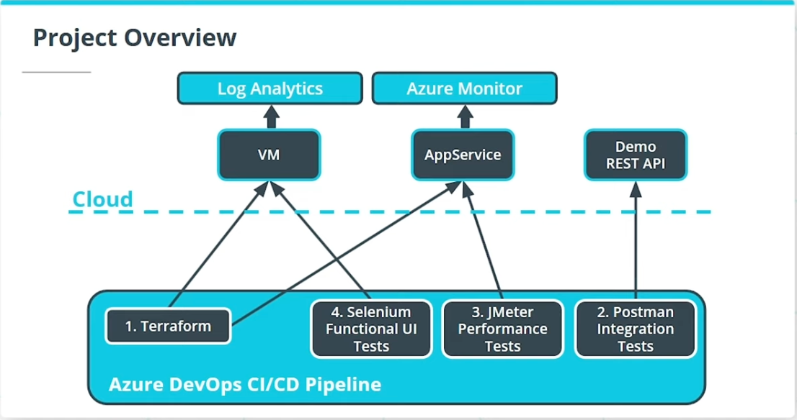

# Ensuring Quality Releases
In this project, we'll develop and demonstrate our skills in using a variety of industry leading tools, especially Microsoft Azure, to create disposable test environments and run a variety of automated tests with the click of a button. Additionally, we'll monitor and provide insight into our application's behavior, and determine root causes by querying the application’s custom log files.


## Getting Started

Instructions for how to get a copy of the project running on your local machine.

### Dependencies
The following dependecies of the project are needed;

- [Azure CLI](https://docs.microsoft.com/en-us/cli/azure/)
- [Terraform](https://www.terraform.io/downloads.html)
- [JMeter](https://jmeter.apache.org/download_jmeter.cgi):

  Use JMeter to open the `automatedtesting/jmeter/Starter.jmx` file.
Replace the APPSERVICEURL with the URL of your AppService once it's deployed.
- [Postman](https://www.postman.com/downloads/)
- [Python](https://www.python.org/downloads/)
- [Selenium](https://sites.google.com/a/chromium.org/chromedriver/getting-started)
  
  Download the latest Chrome driver. You will also need to add the chromedriver to PATH.
    ```bash
    pip install -U selenium
    sudo apt-get install -y chromium-browser
    ```
  Execute the `/automatedtesting/selenium/login.py` file to open the demo site.


Altogether, our pipeline will create a number of resources:

:white_check_mark:   A resource group

:white_check_mark:   An App Service

:white_check_mark:   A Virtual Network

:white_check_mark:   A Network Security Group

:white_check_mark:   A Virtual Machine

Our demo REST API is deployed as part of our App Service, and our tests are executed against the REST API from the virtual machine created by Terraform as part of the CI/CD pipeline.



### Installation

Step by step explanation of how to get a dev environment running.

List out the steps

```
(base) alirezamirsadraee@Alirezas-MBP cd1807-Project-Ensuring-Quality-Releases % terraform/environments/test/configure-tfstate-storage-account.sh 
The public access to all blobs or containers in the storage account will be disallowed by default in the future, which means default value for --allow-blob-public-access is still null but will be equivalent to false.
{
  "accessTier": "Hot",
  "accountMigrationInProgress": null,
  "allowBlobPublicAccess": false,
  "allowCrossTenantReplication": false,
  "allowSharedKeyAccess": null,
  "allowedCopyScope": null,
  "azureFilesIdentityBasedAuthentication": null,
  "blobRestoreStatus": null,
  "creationTime": "2023-12-28T11:46:11.023273+00:00",
  "customDomain": null,
  "defaultToOAuthAuthentication": null,
  "dnsEndpointType": null,
  "enableHttpsTrafficOnly": true,
  "enableNfsV3": null,
  "encryption": {
    "encryptionIdentity": null,
    "keySource": "Microsoft.Storage",
    "keyVaultProperties": null,
    "requireInfrastructureEncryption": null,
    "services": {
      "blob": {
        "enabled": true,
        "keyType": "Account",
        "lastEnabledTime": "2023-12-28T11:46:11.179529+00:00"
      },
      "file": {
        "enabled": true,
        "keyType": "Account",
        "lastEnabledTime": "2023-12-28T11:46:11.179529+00:00"
      },
      "queue": null,
      "table": null
    }
  },
  "extendedLocation": null,
  "failoverInProgress": null,
  "geoReplicationStats": null,
  "id": "/subscriptions/44ada2e4-89f9-41cc-8efc-3cf76cd05c0c/resourceGroups/Azuredevops/providers/Microsoft.Storage/storageAccounts/tfstate341231001",
  "identity": null,
  "immutableStorageWithVersioning": null,
  "isHnsEnabled": null,
  "isLocalUserEnabled": null,
  "isSftpEnabled": null,
  "isSkuConversionBlocked": null,
  "keyCreationTime": {
    "key1": "2023-12-28T11:46:11.179529+00:00",
    "key2": "2023-12-28T11:46:11.179529+00:00"
  },
  "keyPolicy": null,
  "kind": "StorageV2",
  "largeFileSharesState": null,
  "lastGeoFailoverTime": null,
  "location": "westeurope",
  "minimumTlsVersion": "TLS1_0",
  "name": "tfstate341231001",
  "networkRuleSet": {
    "bypass": "AzureServices",
    "defaultAction": "Allow",
    "ipRules": [],
    "ipv6Rules": [],
    "resourceAccessRules": null,
    "virtualNetworkRules": []
  },
  "primaryEndpoints": {
    "blob": "https://tfstate341231001.blob.core.windows.net/",
    "dfs": "https://tfstate341231001.dfs.core.windows.net/",
    "file": "https://tfstate341231001.file.core.windows.net/",
    "internetEndpoints": null,
    "microsoftEndpoints": null,
    "queue": "https://tfstate341231001.queue.core.windows.net/",
    "table": "https://tfstate341231001.table.core.windows.net/",
    "web": "https://tfstate341231001.z6.web.core.windows.net/"
  },
  "primaryLocation": "westeurope",
  "privateEndpointConnections": [],
  "provisioningState": "Succeeded",
  "publicNetworkAccess": null,
  "resourceGroup": "Azuredevops",
  "routingPreference": null,
  "sasPolicy": null,
  "secondaryEndpoints": null,
  "secondaryLocation": null,
  "sku": {
    "name": "Standard_LRS",
    "tier": "Standard"
  },
  "statusOfPrimary": "available",
  "statusOfSecondary": null,
  "storageAccountSkuConversionStatus": null,
  "tags": {},
  "type": "Microsoft.Storage/storageAccounts"
}
{
  "created": true
}
RESOURCE_GROUP_NAME=Azuredevops
STORAGE_ACCOUNT_NAME=tfstate341231001
CONTAINER_NAME=tfstate
ACCOUNT_KEY=AxrP6DzaxhCGZf2CdVU0iomOFjlsuZFp4mHPpos0cd4YNSrKgp2tAh17fvxvyjna5yUk7mOo/U3R+ASthJ/oGg==
```

## Testing

Explain the steps needed to run any automated tests

### Break Down Tests

Explain what each test does and why

```
Examples here
```

## Project Instructions

This section should contain all the student deliverables for this project.

## Built With

* [Item1](www.item1.com) - Description of item
* [Item2](www.item2.com) - Description of item
* [Item3](www.item3.com) - Description of item

Include all items used to build project.

## License

[License](LICENSE.txt)
